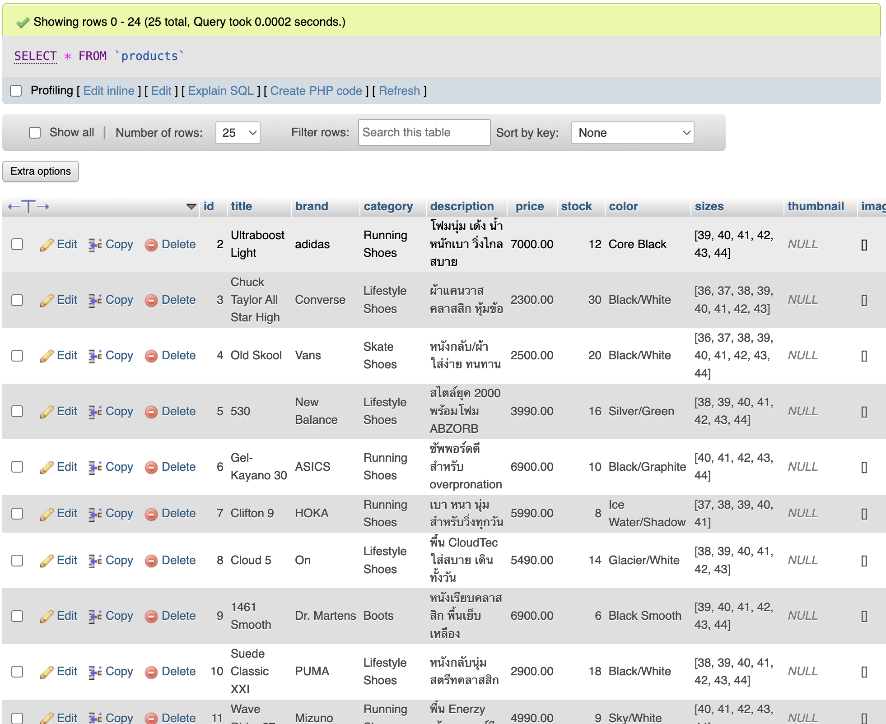
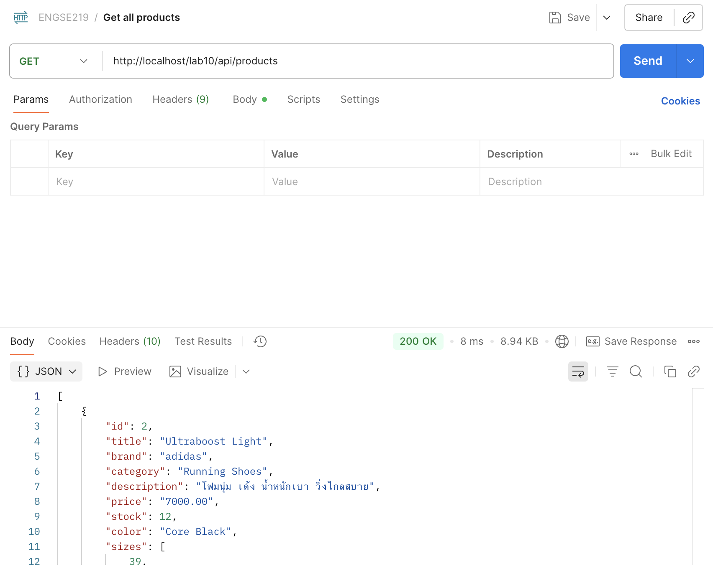
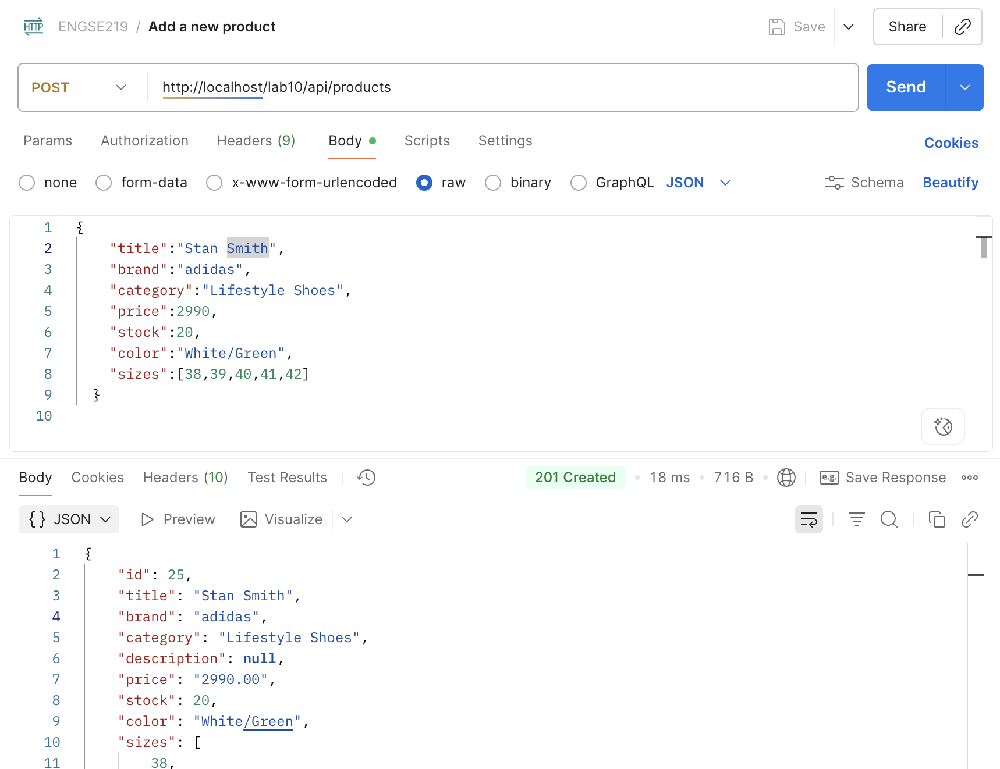
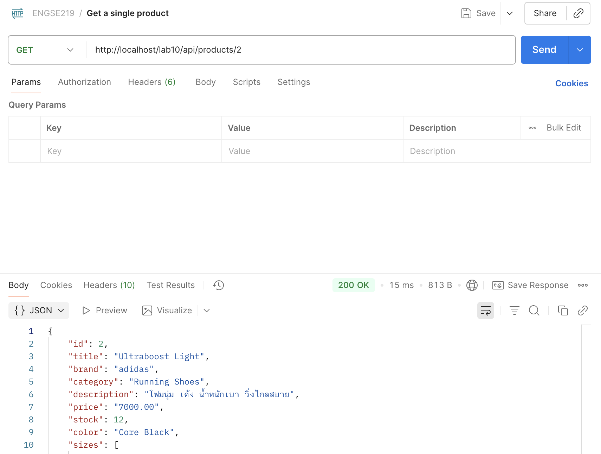
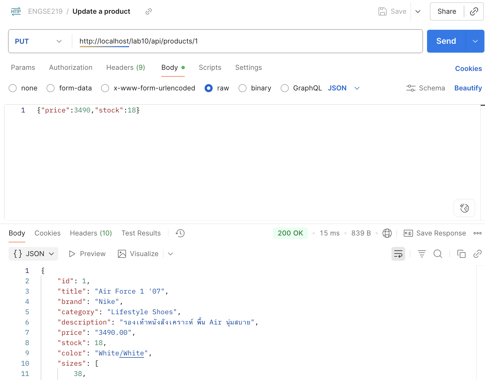
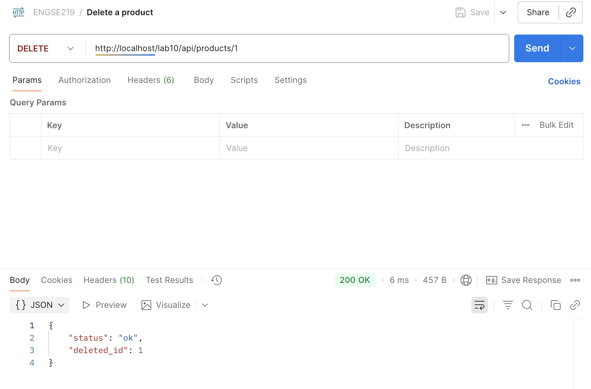

# Lab10-WebAPI (PHP + MySQL on XAMPP)

โปรเจกต์นี้เป็นงาน **Lab10 - Web API**  
โดยใช้ฐานข้อมูล MySQL และ Web API (PHP) ทำ CRUD (Create, Read, Update, Delete) สำหรับตาราง `products`  

---

## 1. Database
- Database: `lab10_webapi`  
- Table: `products`  
- Data: ตัวอย่างสินค้ารองเท้า 24 รายการ  
- File: `lab10_webapi.sql`  

ตัวอย่างฟิลด์หลัก:
- `id` (Primary Key, Auto Increment)  
- `title` (ชื่อสินค้า)  
- `brand` (ยี่ห้อ)  
- `category` (หมวดหมู่)  
- `description` (รายละเอียดสินค้า)  
- `price` (ราคา)  
- `stock` (จำนวนคงเหลือ)  
- `color` (สี)  
- `sizes` (เก็บเป็น JSON array)  
- `rating` (คะแนนรีวิว)  

---

## 2. API
โค้ดอยู่ในโฟลเดอร์ `api/`

### Endpoints
- `GET /products` → ดึงสินค้าทั้งหมด  
- `GET /products/{id}` → ดึงสินค้าตาม id  
- `POST /products` → เพิ่มสินค้าใหม่  
- `PUT /products/{id}` → แก้ไขสินค้า  
- `DELETE /products/{id}` → ลบสินค้า  

---

## 3. การติดตั้งและใช้งาน
1. Import Database  
   - เปิด phpMyAdmin  
   - เลือก **Import** → เลือกไฟล์ `lab10_webapi.sql`  
2. วางโฟลเดอร์ `api/` ไว้ที่ `htdocs/lab10/api/`  
3. แก้ไขไฟล์ `db.php` หากต้องการเปลี่ยนค่าการเชื่อมต่อ เช่น:
   ```php
   $DB_HOST = '127.0.0.1';
   $DB_NAME = 'lab10_webapi';
   $DB_USER = 'root';
   $DB_PASS = '';


---

## Screenshot

### phpMyAdmin (Products Table)


### GET - Get all products


### POST - Add a new product


### GET - Get a single product


### PUT - Update a product


### DELETE - Delete a product



---

## ผู้จัดทำ
- ชื่อ: **นาณัฐสิทธิ์ มะโนชัย**  
- รหัสนักศึกษา: **67543210056-7**
